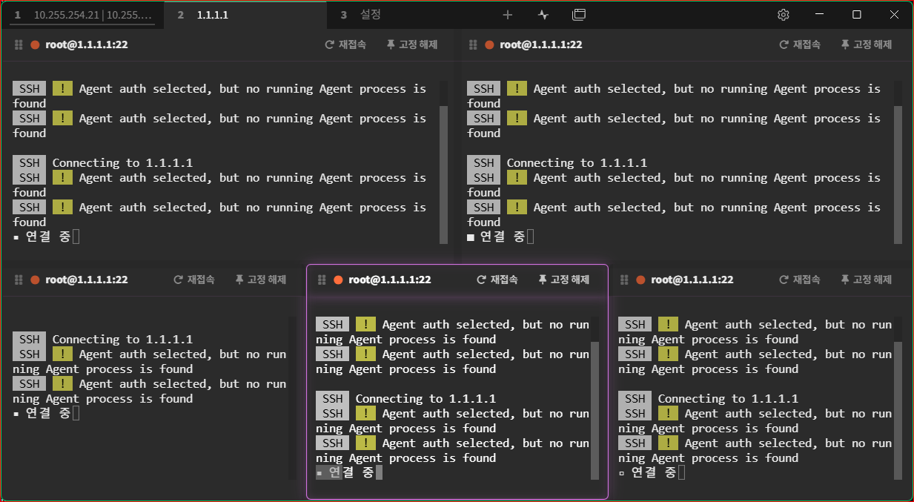
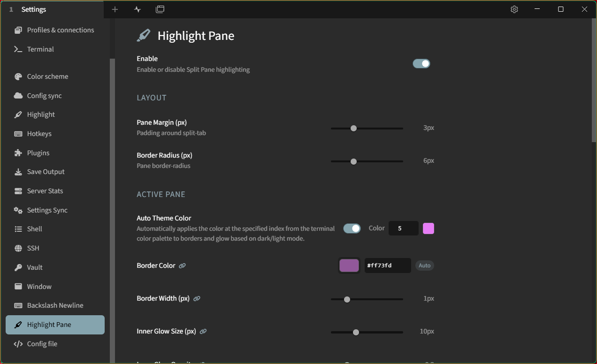

A [Tabby](https://tabby.sh) plugin that visually highlights the **active split pane** with a customizable border glow and dims inactive panes — making it easy to tell at a glance which terminal you're working in.

---

## 📸 Screenshots

|               Active Pane Highlighting               |                   Plugin Settings UI                    |
|:----------------------------------------------------:|:-------------------------------------------------------:|
|          |                |
| *Active terminal pane with customizable glow effect* | *Comprehensive configuration options in Tabby settings* |

---

## ✨ Features

- **Active pane highlight** — configurable border color, width, and inner/outer glow effect
- **Inactive pane dimming** — smoothly lowers opacity of unfocused panes (only in split layouts)
- **Toolbar highlight** — brightens the toolbar of the focused pane with a matching border and glow
- **Smooth transitions** — per-section configurable duration (active / inactive / toolbar) with direction-aware easing
- **Active ↔ Toolbar sync** — link or decouple active pane and toolbar settings independently
- **Auto theme color** — automatically picks a color from the current terminal palette (dark/light aware)
- **Rounded pane layout** — adds `border-radius` and optional spacing between panes
- **Built-in settings UI** — all options are editable in Tabby's **Settings → Highlight Pane** panel
- **Multilingual** — English and Korean UI (follows Tabby's language setting)
- **CSS-first, zero DOM observation** — split detection and focus state are handled entirely by CSS; no `MutationObserver` required

## 🛠️ Development

### Prerequisites

- Node.js 16+
- Tabby installed (for testing)

### Build

``` bash
# Install dependencies
npm install

# Build once
npm run build
```

### Project structure

```
src/
├── index.ts                             # NgModule entry point + CSS injection + config/theme subscriptions
├── config.ts                            # HighlightConfig interface & defaults
├── style-generator.ts                   # CSS string generator (CSS-first, :has() selector based)
├── theme-utils.ts                       # Terminal color palette helper (dark/light mode aware)
├── highlightPaneSettingsTabProvider.ts  # Settings panel registration
├── api.ts                               # Public API exports
├── components/
│   └── highlight-pane-settings.component.ts  # Settings UI component
├── services/
│   └── plugin-i18n.service.ts           # i18n initialization (en-US / ko)
└── i18n/
    ├── en-US.ts                         # English translations
    └── ko.ts                            # Korean translations
```

### How it works

1. **CSS Injection** — On module load, a `<style id="highlight-pane-css">` element is inserted into `document.head` with all visual rules generated from the current configuration.
2. **CSS-first split & focus detection** — Split state is detected via `split-tab:has(> .child:nth-child(2))` and focus state via the `.focused` class already maintained by Tabby — no JavaScript observation needed.
3. **Reactive CSS update** — Subscriptions to `configService.changed$` and `themesService.themeChanged$` regenerate and replace the style block whenever settings or the active theme change.
4. **Settings** — `HighlightPaneSettingsTabProvider` registers a settings tab; changes trigger `configService.save()` which fires `changed$` and immediately updates the visuals.

## 🤝 Contributing

Contributions, issues, and feature requests are welcome!

Feel free to open an [issue](../../issues) or submit a pull request.
